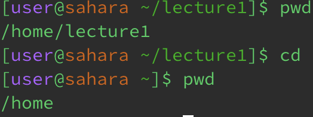
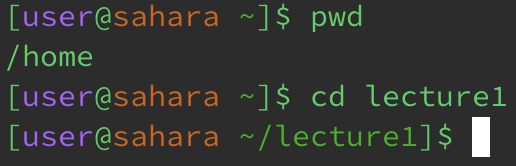
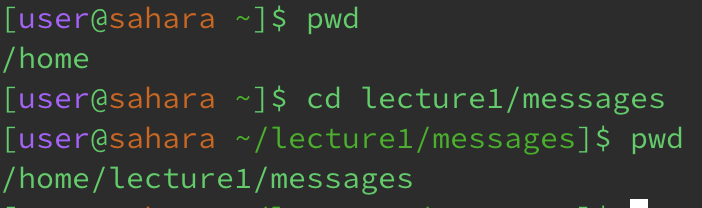
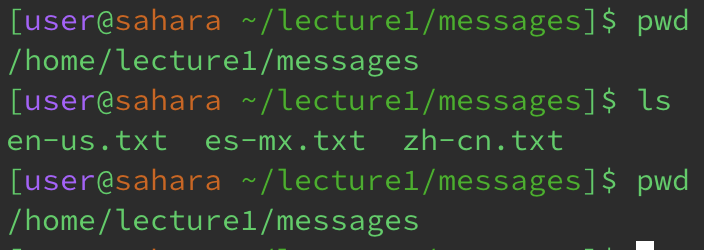
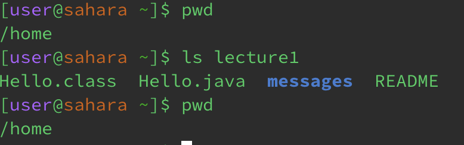
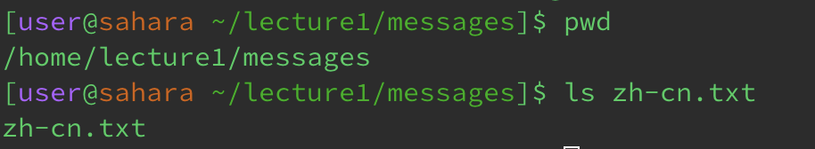
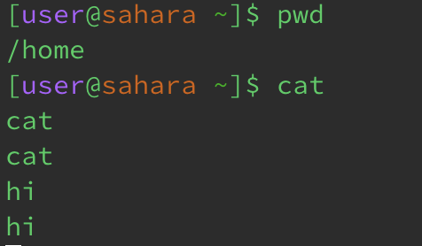
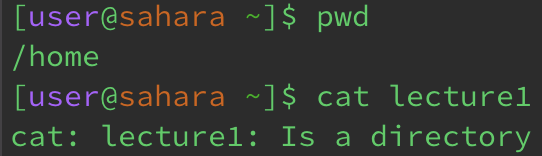
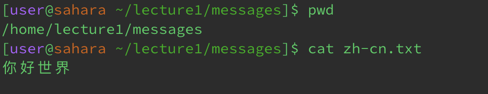

# Lab 1 Report - Remote Access and FileSystem
**cd**
1. Share an example of using the command with no arguments.

- I got this output as I was previously in the directory of lecture1, but I changed the directory with no arguments and that led to it exiting the directory it was in (lecture1) and going back to the home page. The output is not an error.
2. Share an example of using the command with a path to a directory as an argument.

- I got the output of changing the directory back to the lecture1 directory 
3. Share an example of using the command with a path to a file as an argument.

-

**ls**
1. Share an example of using the command with no arguments.

- 
2. Share an example of using the command with a path to a directory as an argument.

- 
3. Share an example of using the command with a path to a file as an argument.

**cat**
1. Share an example of using the command with no arguments.

- As my output, I got anything that I typed into the terminal returned back.
2. Share an example of using the command with a path to a directory as an argument.

- 
3. Share an example of using the command with a path to a file as an argument.

- 
