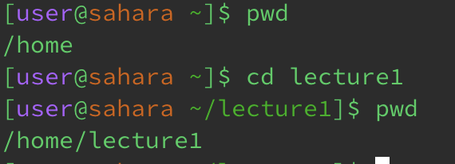

# Lab 1 Report - Remote Access and FileSystem
**cd**
1. Share an example of using the command with no arguments.

- I got this output as I was previously in the directory of lecture1, but I changed the directory with no arguments and that led to it exiting the directory it was in (lecture1) and going back to the home page. The output is not an error.
2. Share an example of using the command with a path to a directory as an argument.

- Before the command was run, the working directory was the home. However, as I changed the directory with a path to directory lecture1, I got the output /home/lecture1 when checking the working directory, demonstrating that it successfully changed directories into the specified directory (lecture1). This output is not a mistake.
3. Share an example of using the command with a path to a file as an argument.

- Prior to running the command, the working directory was stationed at home. When running the command, I got the output of the directory being changed to the file of the messages within the lecture1 directory. This output was not an error as it was intentional by the written command.

**ls**
1. Share an example of using the command with no arguments.

- When using this command without any arguments that is already in the directory of a file, it lists the files within that file. This output is not an error.
2. Share an example of using the command with a path to a directory as an argument.

- 
3. Share an example of using the command with a path to a file as an argument.

**cat**
1. Share an example of using the command with no arguments.

- As my output, I got anything that I typed into the terminal returned back.
2. Share an example of using the command with a path to a directory as an argument.

- 
3. Share an example of using the command with a path to a file as an argument.

- 
