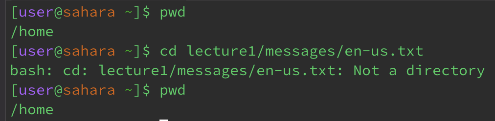

# Lab 1 Report - Remote Access and FileSystem
**cd**
1. Share an example of using the command with no arguments.

- Before the command was run, the working command was /home/lecture1. When running the command cd without an arguments, the working directory exited lecture1 and returned back to /home. The output is not an error.
2. Share an example of using the command with a path to a directory as an argument.

- Before the command was run, the working directory was /home. However, as I changed the directory with a path to directory lecture1, I got the output /home/lecture1, demonstrating that it successfully changed directories into the specified directory (lecture1). This output is not a mistake.
3. Share an example of using the command with a path to a file as an argument.

- Prior to running the command, the working directory is /home. When running the command, the output throws an error stating that the file en-us.txt is not a directory; therefore, the command didn't go through and the working directory is still /home.

**ls**
1. Share an example of using the command with no arguments.

- Before running the command, the working directory is /lecture1/messages. When using this command without any arguments that is already in the directory of a folder, it lists the files within that folder. This output is not an error.
2. Share an example of using the command with a path to a directory as an argument.

- Before running the command, the working directory is /home. When the command is ran, the output lists the names of the files and directory within the lecture1 folder, which is not an error.
3. Share an example of using the command with a path to a file as an argument.

-Before running the command, the working directory is /lecture1/messages. When the command is ran, the output gives the name of the file zh-cn.txt, which is not an error.

**cat**
1. Share an example of using the command with no arguments.

- Before running the command, my working directory was /home. As my output, I got anything that I typed into the terminal returned back, which is not an error as no error message is printed.
2. Share an example of using the command with a path to a directory as an argument.

- Before running the command, my working directory was /home. As my output, I got an error stating that lecture1 is a directory and therefore cannot be used as the cat command prints the content of file(s) but not a directory.
3. Share an example of using the command with a path to a file as an argument.

- Before running the command, my working directory was /home/lecture1/messages. As my output, the contents of file zh-cn.txt were printed out, which is not an error.
